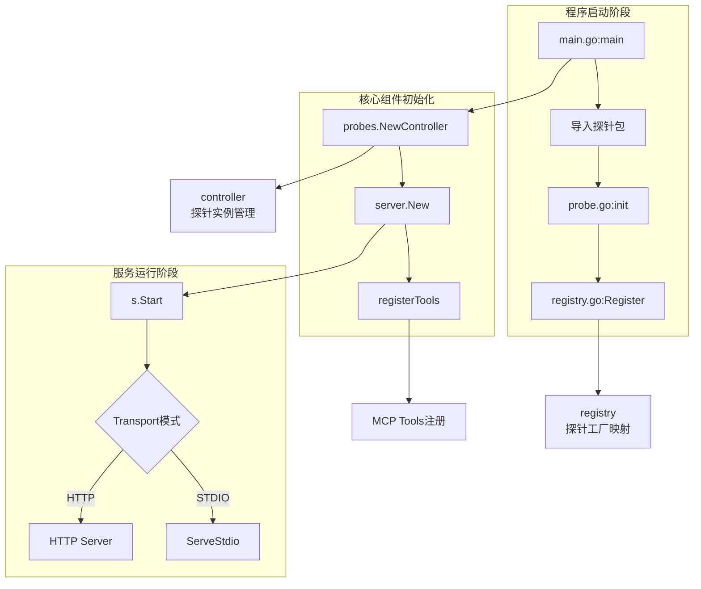
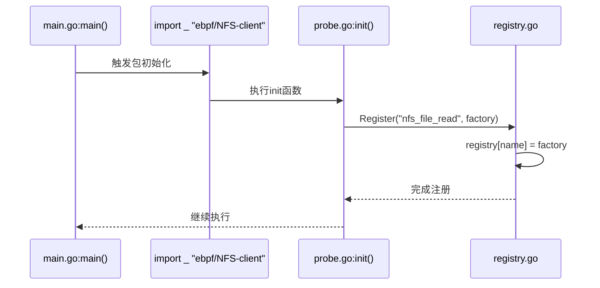
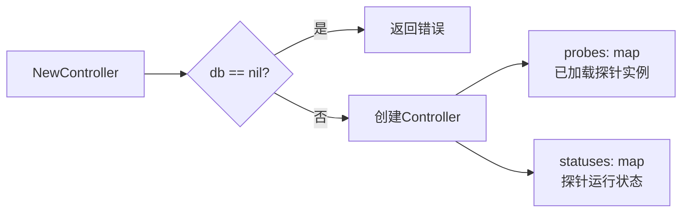
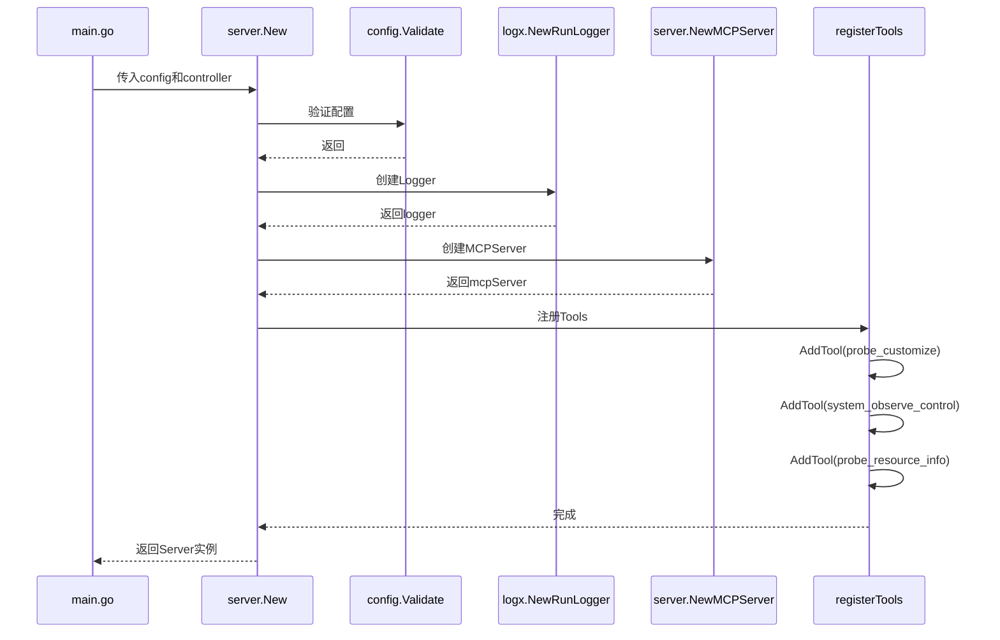
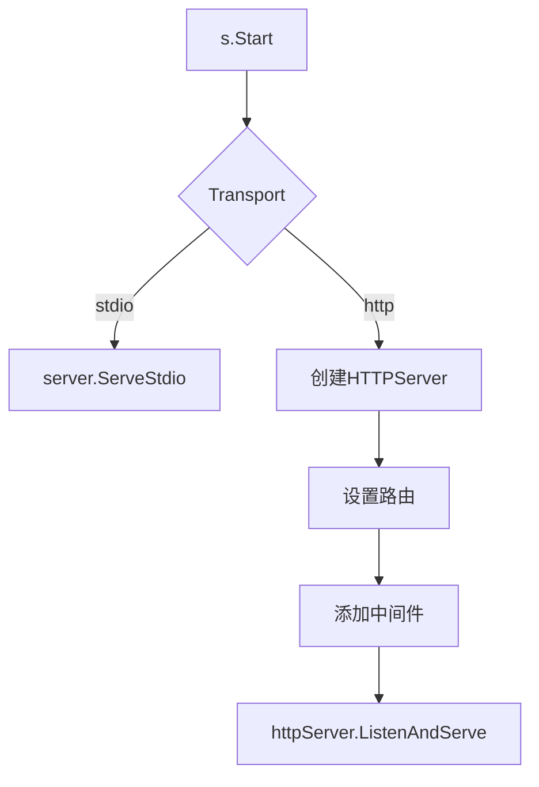
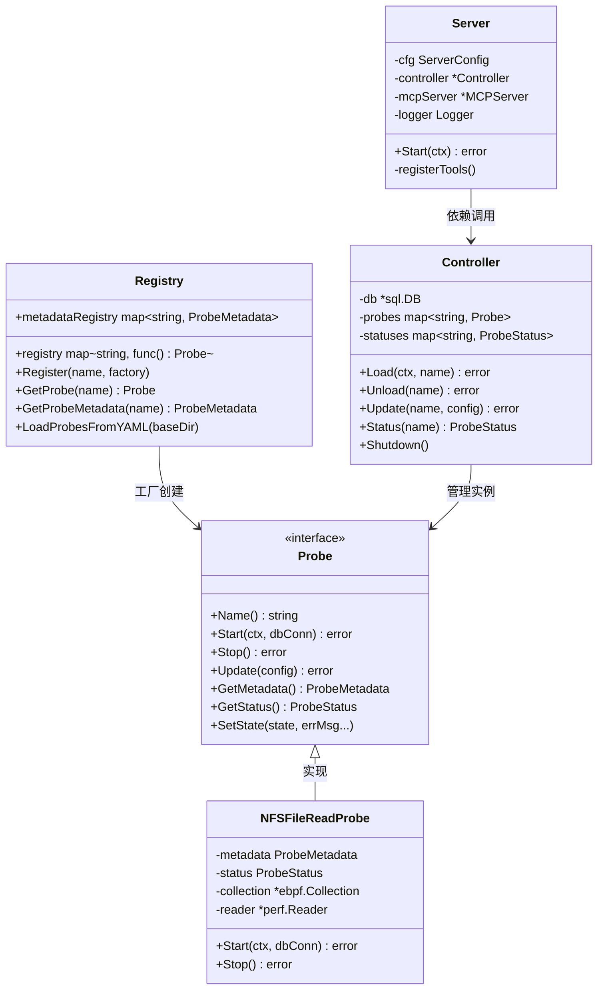

# MCP启动到探针注册全流程

本文档详细描述eBPF-MCP从启动到探针注册的完整流程，包括函数调用关系和关键组件交互。

## 一、整体流程概览



## 二、详细流程分析

### 2.1 程序入口与探针预注册

**入口文件**: `main.go`



**关键代码** (`main.go:15`):
```go
import (
    _ "ebpf-mcp/ebpf/NFS-client"  // 触发init()执行
)
```

**探针自注册** (`ebpf/NFS-client/nfs_file_read/probe.go:22-26`):
```go
func init() {
    probes.Register("nfs_file_read", func() probes.Probe {
        return NewNFSFileReadProbe()
    })
}
```

### 2.2 Controller初始化

**文件**: `internal/probes/controller.go:36-45`



**关键代码**:
```go
func NewController(db *sql.DB) (*Controller, error) {
    if db == nil {
        return nil, fmt.Errorf("db is nil")
    }
    return &Controller{
        db:       db,
        probes:   make(map[string]Probe),      // 已加载的探针实例
        statuses: make(map[string]ProbeStatus), // 探针状态
    }, nil
}
```

### 2.3 Server初始化与Tools注册

**文件**: `internal/server/server.go:25-57`



### 2.4 服务启动



## 三、核心数据结构关系



## 四、关键问题与注意事项

### 4.1 YAML配置加载现状

**重要发现**: `LoadProbesFromYAML` 函数当前**未被main.go调用**，仅在测试中使用。

**影响**:
- 探针元数据只能从代码中的默认配置获取
- `probes/` 目录下的YAML配置文件**不会被自动加载**

**代码位置** (`internal/probes/registry.go:32-55`):
```go
func LoadProbesFromYAML(baseDir string) error {
    probesDir := filepath.Join(baseDir, "probes")
    // 遍历YAML文件并解析到metadataRegistry
}
```

**建议修复**: 在 `main.go` 的controller创建之前添加：
```go
// 加载YAML探针配置
if err := probes.LoadProbesFromYAML("."); err != nil {
    log.Printf("Warning: failed to load probe YAML configs: %v", err)
}
```

### 4.2 探针注册依赖

当前实现依赖Go的`init()`机制：

1. **必须显式导入探针包**，否则不会触发`init()`
2. **导入顺序**影响注册顺序（虽然通常不重要）
3. **未导入的探针**不会自动注册

**当前导入** (`main.go:15`):
```go
_ "ebpf-mcp/ebpf/NFS-client"  // 仅NFS-client探针被注册
```

## 五、函数调用关系汇总

### 5.1 启动阶段调用链

```
main()
├── 导入 _ "ebpf-mcp/ebpf/NFS-client"
│   └── probe.go:init()
│       └── probes.Register("nfs_file_read", factory)
│           └── registry[name] = factory
│
├── probes.NewController(db)
│   └── 创建Controller{probes: map, statuses: map}
│
├── server.New(cfg, controller)
│   ├── config.Validate()
│   ├── logx.NewRunLogger()
│   ├── server.NewMCPServer()
│   └── registerTools()
│       ├── AddTool("probe_customize")
│       ├── AddTool("system_observe_control")
│       └── AddTool("probe_resource_info")
│
└── s.Start(ctx)
    ├── STDIO: server.ServeStdio()
    └── HTTP: http.ListenAndServe()
```

### 5.2 探针加载调用链（运行时）

```
system_observe_control Tool
└── controller.Load(ctx, name)
    ├── GetProbe(name) -> factory()
    │   └── NewNFSFileReadProbe()
    │       └── GetProbeMetadata(name)
    └── probe.Start(ctx, db)
        ├── ebpf.LoadCollection()
        ├── ebpf.Attach()
        └── 启动事件消费goroutine
```

## 六、关键文件索引

| 组件 | 文件路径 | 关键函数/类型 |
|------|---------|--------------|
| 程序入口 | `main.go` | `main()` |
| Server | `internal/server/server.go` | `New()`, `Start()`, `registerTools()` |
| Server配置 | `internal/server/config.go` | `ServerConfig`, `Validate()` |
| Controller | `internal/probes/controller.go` | `Controller`, `NewController()`, `Load()`, `Unload()` |
| Registry | `internal/probes/registry.go` | `Register()`, `GetProbe()`, `LoadProbesFromYAML()` |
| Probe接口 | `internal/probes/probe.go` | `Probe`接口, `ProbeMetadata`, `ProbeStatus` |
| NFS探针 | `ebpf/NFS-client/nfs_file_read/probe.go` | `init()`, `NFSFileReadProbe` |
| YAML配置 | `probes/nfs-file-read.yaml` | 探针元数据配置 |

## 七、流程验证结论

经代码审查，当前流程为：

1. ✅ **启动协议层**: `server.New()` 创建MCPServer并注册Tools
2. ✅ **启动Controller**: `probes.NewController()` 创建控制器实例
3. ⚠️ **YAML元数据加载**: `LoadProbesFromYAML()` **未被调用**，YAML配置未自动加载
4. ✅ **探针工厂注册**: 通过`init()`机制在导入时完成

**待修复问题**: 需要在 `main.go` 中添加 `LoadProbesFromYAML` 调用来启用YAML配置加载。
